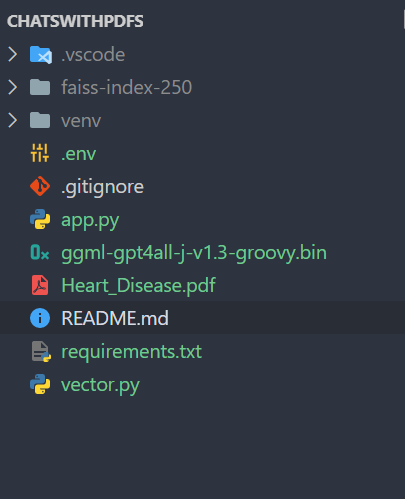
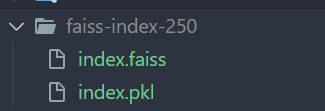
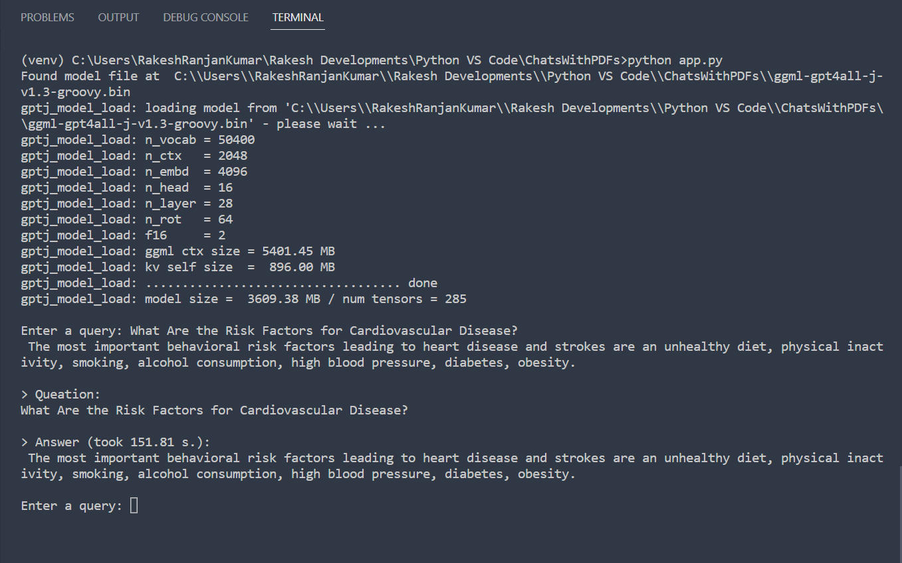

Hi EveryOne, This is Awesome-LLM is a curated list of papers about large language models, especially relating to ChatGPT. It also contains frameworks for LLM training, tools to deploy LLM, courses and tutorials about LLM and all publicly available LLM checkpoints and APIs. [The repository is maintained by mr-rakesh-ranjan on GitHub.](https://github.com/mr-rakesh-ranjan/ChatsWithPDFs)

## Process for Installing

- Steps
    1. Create Virtual environments using 'python -m venv v_env'
    2. Activate virtual environments using 
        In powershell 'v_env\Scripts\Activate.ps1'
        In cmd 'v_env\Scripts\activate.bat'
    3. Install all requirements.txt using 'pip install -r requirements.txt'
    4. After all installments Dowonload 'ggml-gpt4all-j-v1.3-groovy.bin' file from this link. [ggml-gpt4all-j-v1.3-groovy](https://huggingface.co/orel12/ggml-gpt4all-j-v1.3-groovy/tree/main)
    5. Save that .bin file to the root folder.

    

    7. Now Run the vector.py using 'python vector.py'
    
        -> After running previous command, a folder is created with name 'faiss-index-250' which contains two file 1. index.faiss and 2. index.pkl

        
    8. Lastly Run the app.py using 'python app.py' and ASK YOUR QUESTIONS FROM THE PDF
    
